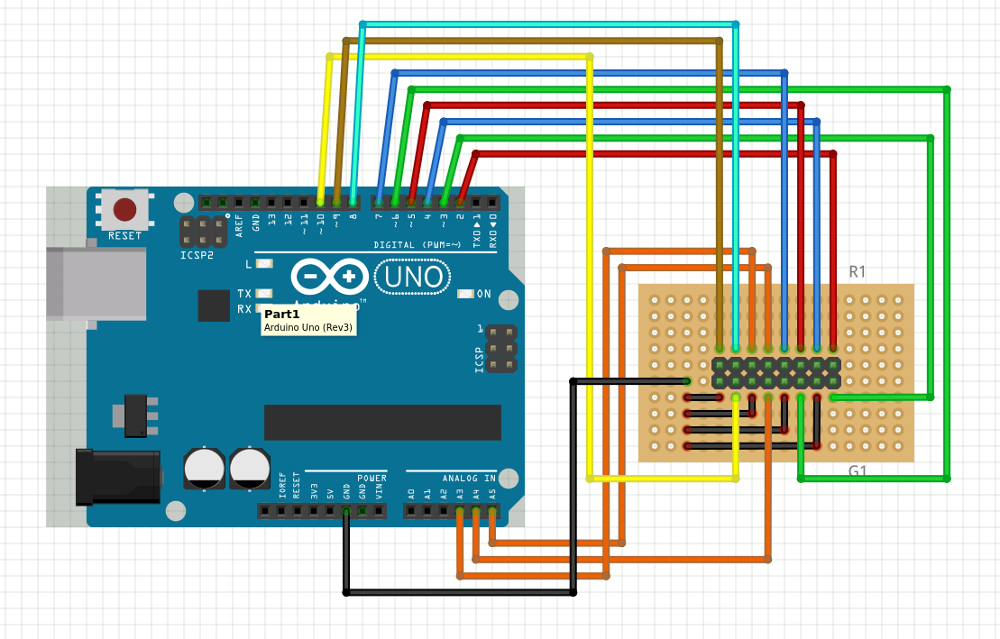

# LED_board

GeekDojoの入り口にある電光掲示板です。

# 使用物品
- Arduino Uno
- [16x32 RGB LED マトリックスパネル](https://www.switch-science.com/catalog/924/)
- [Arduino用ユニバーサル基板](http://akizukidenshi.com/catalog/g/gP-06877/)

# ユニバーサル基板
以下のように配線する

